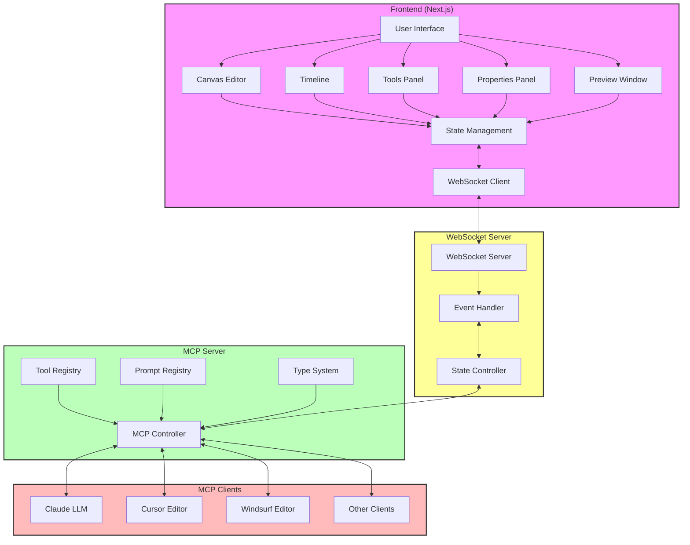

# Ainimate Architecture

## Overview

Ainimate is a web-based animation creation platform that leverages AI capabilities through Claude and a Model Context Protocol (MCP) server. The system is built with a modern, scalable architecture that combines Next.js for the frontend, a dedicated WebSocket server for real-time state synchronization, and a TypeScript-based MCP server for AI interactions.

## System Architecture Diagram



## Project Structure

The project is organized as a monorepo with the following main packages:

```
ainimate/
├── ainimate/               # Next.js frontend application
├── ainimate-mcp-server/   # MCP server for AI interactions
├── ainimate-mcp-websocket/# WebSocket server for real-time state
├── scripts/               # Development and build scripts
└── package.json           # Workspace configuration
```

## System Components

### 1. Frontend (Next.js Application)

The frontend is built with Next.js and consists of several key components:

- **Canvas Editor**: Interactive workspace where animations are created and edited
- **Timeline**: Controls for managing animation frames and playback
- **Tools Panel**: Interface for accessing various animation tools
- **Properties Panel**: Controls for adjusting element properties
- **Preview Window**: Real-time animation preview
- **WebSocket Client**: Handles real-time communication with the WebSocket server

### 2. WebSocket Server

A dedicated server handling real-time state synchronization between the frontend and MCP server:

- **Event Handler**: Processes incoming WebSocket events
- **State Controller**: Manages state updates and broadcasts
- **Connection Manager**: Handles WebSocket client connections and disconnections

### 3. MCP Server

The MCP server acts as a bridge between Claude and the animation engine:

- **Tool Registry**: Manages available tools for Claude
  - Project Management
  - Scene Management
  - Element Creation
  - Animation Controls
- **Prompt Registry**: Pre-defined templates for common animation tasks
- **Type System**: Strongly typed interfaces for all operations

## Data Flow

1. **User Interaction**
   - User interacts with the Next.js UI
   - Actions are captured by the state management system
   - State changes are sent to the WebSocket server

2. **Real-time State Synchronization**
   - WebSocket server receives state updates
   - Updates are processed and validated
   - Changes are broadcast to connected clients
   - Frontend updates in real-time

3. **Claude Integration**
   - State changes requiring AI assistance are forwarded to the MCP server
   - Claude processes requests using registered tools
   - Responses are sent back through the WebSocket server
   - UI updates reflect AI-generated changes

## Implementation Details

### WebSocket Server Types

```typescript
// Event Types
interface WebSocketEvent {
  type: WebSocketEventType;
  payload: any;
  clientId?: string;
  timestamp: number;
}

enum WebSocketEventType {
  STATE_UPDATE = 'state_update',
  ELEMENT_CREATED = 'element_created',
  ELEMENT_UPDATED = 'element_updated',
  FRAME_CAPTURED = 'frame_captured',
  CLIENT_CONNECTED = 'client_connected',
  CLIENT_DISCONNECTED = 'client_disconnected'
}

// State Management
interface StateUpdate {
  path: string[];
  value: any;
  timestamp: number;
}
```

### Frontend State Management

```typescript
interface EditorState {
  currentProject: Project;
  currentScene: Scene;
  selectedElements: Element[];
  timeline: {
    currentFrame: number;
    totalFrames: number;
  };
  websocket: {
    connected: boolean;
    lastUpdate: number;
  };
}
```

### Development Setup

To run the project locally:

```bash
# Install dependencies
yarn install

# Start all services in development mode
yarn dev

# Or start services individually:
yarn app      # Start Next.js frontend
yarn websocket# Start WebSocket server
yarn mcp      # Start MCP server
```

## Security Considerations

1. **WebSocket Security**
   - Implement WebSocket authentication
   - Validate all incoming messages
   - Rate limiting for connections and messages
   - Secure WebSocket connections with SSL/TLS

2. **State Management Security**
   - Validate state updates before processing
   - Implement proper access control
   - Sanitize data before broadcasting

3. **MCP Security**
   - Validate all tool inputs
   - Sanitize responses before processing
   - Implement proper error handling

## Performance Optimizations

1. **WebSocket Optimizations**
   - Message batching for bulk updates
   - Binary message format for efficiency
   - Heartbeat mechanism for connection health
   - Reconnection strategy with exponential backoff

2. **State Management**
   - Efficient state diffing
   - Partial state updates
   - State compression for large updates
   - Client-side state caching

## Future Considerations

1. **Scaling**
   - WebSocket server clustering
   - Redis for pub/sub between WebSocket instances
   - Load balancing for WebSocket connections
   - Microservices for specific features

2. **Features**
   - Collaborative editing through WebSocket
   - Real-time cursors and presence
   - Shared animation previews
   - AI-powered real-time suggestions

3. **Monitoring**
   - WebSocket metrics collection
   - Performance monitoring
   - Error tracking and reporting
   - Usage analytics

## Conclusion

The updated architecture with a dedicated WebSocket server provides improved real-time capabilities and better separation of concerns. The system is now more scalable and maintainable, with clear boundaries between the frontend, real-time communication layer, and AI integration through the MCP server. 
